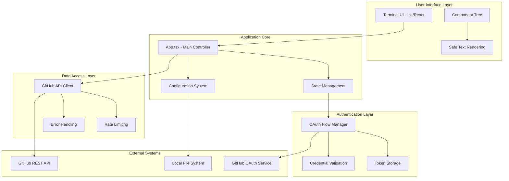
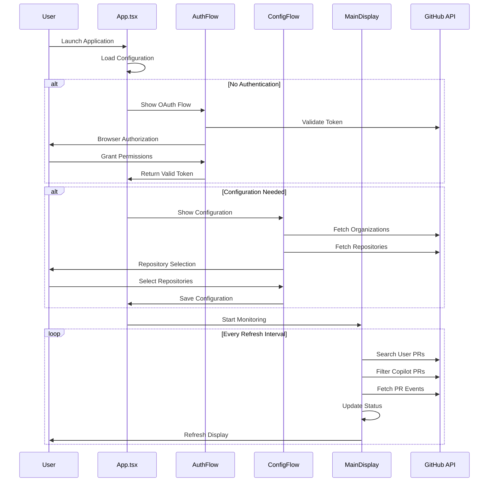

# Architecture Documentation

Technical architecture and design documentation for the Copilot Neural Swarm.

## System Overview

The Copilot Neural Swarm is a TypeScript-based Node.js application that provides real-time monitoring of GitHub Copilot activity through a terminal-based user interface.

## Architecture Diagram



## Technology Stack

### Core Technologies

- **TypeScript**: Type-safe development with compile-time error checking
- **Node.js**: Runtime environment for server-side JavaScript
- **React**: Component-based UI library
- **Ink**: Terminal UI framework built on React

### Key Dependencies

- **axios**: HTTP client for GitHub API integration
- **commander**: Command-line argument parsing
- **conf**: Cross-platform configuration management
- **open**: Cross-platform tool to open URLs in browsers

## Layer Architecture

### 1. User Interface Layer

**Location**: `src/components/`

**Components**:

- **App.tsx**: Main application controller and state management
- **AuthFlow.tsx**: OAuth authentication workflow
- **ConfigFlow.tsx**: Repository configuration interface
- **MainDisplay.tsx**: Primary monitoring dashboard
- **Console.tsx**: Activity logging component

**UI Framework**: Built on Ink (React for terminals)

- Component-based architecture
- Declarative UI updates
- Safe text rendering to prevent crashes

### 2. Application Core

**State Management**: React hooks and context

- Centralized application state
- Configuration persistence
- Error boundary handling

**Configuration System**: `src/utils/config.ts`

- Cross-platform config storage
- Encrypted credential management
- Repository/organization persistence

### 3. Authentication Layer

**OAuth Implementation**: `src/utils/oauth.ts`

- Secure browser-based authentication
- Local HTTP server for callbacks
- CSRF protection with state parameters
- Token validation and refresh

**Security Features**:

- Secure token storage
- Automatic scope validation
- Session management

### 4. Data Access Layer

**GitHub API Client**: `src/utils/github.ts`

- RESTful API integration
- Rate limiting compliance
- Error handling and retries
- Response caching

**Search Optimization**: `src/utils/searchQueries.ts`

- Intelligent query construction
- Dual-assignment filtering
- Repository parsing fallbacks

## Component Architecture

### Main Application Flow



### Component Hierarchy

```
App.tsx (Root)
├── AuthFlow.tsx
│   ├── OAuth browser flow
│   ├── Token validation
│   └── Credential storage
├── ConfigFlow.tsx
│   ├── Organization selection
│   ├── Repository selection
│   └── Configuration persistence
└── MainDisplay.tsx
    ├── Header component
    ├── PR table display
    ├── Activity log panel
    └── Status bar metrics
```

## Data Flow Architecture

### 1. Authentication Flow

```typescript
// OAuth flow implementation
class OAuthFlow {
  async authorize(): Promise<OAuthResult> {
    // 1. Generate secure state parameter
    const state = crypto.randomBytes(20).toString("hex");

    // 2. Start local HTTP server for callback
    const server = await this.startCallbackServer();

    // 3. Open browser to GitHub OAuth URL
    await open(this.buildAuthorizationURL(state));

    // 4. Wait for callback with authorization code
    const code = await this.waitForCallback();

    // 5. Exchange code for access token
    const token = await this.exchangeCodeForToken(code);

    // 6. Validate token and return result
    return this.validateToken(token);
  }
}
```

### 2. Configuration Management

```typescript
// Configuration system
interface AppConfig {
  token?: string;
  clientId?: string;
  clientSecret?: string;
  organizations?: string[];
  repositories?: string[];
  refreshInterval?: number;
}

class ConfigManager {
  private conf = new Conf<AppConfig>({
    projectName: "copilot-pr-monitor",
    encryptionKey: "secure-encryption-key",
  });

  async load(): Promise<AppConfig> {
    return this.conf.store;
  }

  async save(config: Partial<AppConfig>): Promise<void> {
    this.conf.set(config);
  }
}
```

### 3. GitHub API Integration

```typescript
// API client architecture
class GitHubAPIClient {
  private client: AxiosInstance;

  constructor(token: string) {
    this.client = axios.create({
      baseURL: "https://api.github.com",
      headers: {
        Authorization: `Bearer ${token}`,
        Accept: "application/vnd.github.v3+json",
      },
      timeout: 30000,
    });

    // Add rate limiting interceptor
    this.client.interceptors.response.use(
      (response) => response,
      (error) => this.handleRateLimit(error)
    );
  }
}
```

## Type System Architecture

### Core Type Definitions

**GitHub API Types** (`src/types/index.ts`):

```typescript
interface PullRequest {
  id: number;
  number: number;
  title: string;
  html_url: string;
  state: "open" | "closed" | "draft";
  user: GitHubUser;
  assignees: GitHubUser[];
  repository?: Repository;
}

interface Repository {
  id: number;
  name: string;
  full_name: string;
  owner: GitHubUser;
  private: boolean;
}

enum CopilotStatus {
  Working = "Copilot Working",
  WaitingForFeedback = "Waiting for Feedback",
  Error = "Error",
  NoActivity = "No Activity",
}
```

**Application Types**:

```typescript
interface PullRequestWithCopilotStatus extends PullRequest {
  copilotStatus: CopilotStatus;
  repositoryInfo: RepositoryInfo;
}

interface AppState {
  authToken: string | null;
  repositories: string[];
  organizations: string[];
  pullRequests: PullRequestWithCopilotStatus[];
  isLoading: boolean;
  error: string | null;
}
```

### Safe Rendering System

**Problem**: Ink/React crashes when rendering empty strings or undefined values.

**Solution**: Type-safe rendering components:

```typescript
// Safe text component
export const SafeText: React.FC<{ children: string }> = ({ children }) => {
  const safeText = children && children.trim() !== "" ? children : " ";
  return <Text>{safeText}</Text>;
};

// Safe rendering utilities
export const safeString = (value: unknown): string => {
  if (typeof value === "string" && value.trim() !== "") {
    return value;
  }
  return " ";
};
```

## Error Handling Architecture

### 1. Application-Level Error Boundaries

```typescript
// Error boundary for React components
class ErrorBoundary extends React.Component {
  constructor(props: any) {
    super(props);
    this.state = { hasError: false, error: null };
  }

  static getDerivedStateFromError(error: Error) {
    return { hasError: true, error };
  }

  componentDidCatch(error: Error, errorInfo: React.ErrorInfo) {
    debugLog("React Error:", { error, errorInfo });
  }

  render() {
    if (this.state.hasError) {
      return (
        <SafeText>Application Error: {this.state.error?.message}</SafeText>
      );
    }

    return this.props.children;
  }
}
```

### 2. API Error Handling

```typescript
// Resilient API calling with retries
export async function resilientAPICall<T>(
  apiCall: () => Promise<T>,
  maxRetries: number = 3,
  baseDelay: number = 1000
): Promise<T> {
  for (let attempt = 1; attempt <= maxRetries; attempt++) {
    try {
      return await apiCall();
    } catch (error) {
      if (attempt === maxRetries) throw error;

      const delay = baseDelay * Math.pow(2, attempt - 1);
      await new Promise((resolve) => setTimeout(resolve, delay));
    }
  }

  throw new Error("Maximum retry attempts exceeded");
}
```

### 3. Network Error Recovery

```typescript
// Rate limiting handler
private async handleRateLimit(error: AxiosError): Promise<never> {
  if (error.response?.status === 403) {
    const remaining = error.response.headers['x-ratelimit-remaining'];
    const reset = error.response.headers['x-ratelimit-reset'];

    if (remaining === '0') {
      const resetTime = new Date(parseInt(reset) * 1000);
      const waitTime = resetTime.getTime() - Date.now();

      debugLog(`Rate limit exceeded. Waiting ${waitTime}ms`);
      await new Promise(resolve => setTimeout(resolve, Math.min(waitTime, 60000)));
    }
  }

  throw error;
}
```

## Security Architecture

### 1. OAuth Security

- **State Parameter Validation**: CSRF protection
- **Secure Token Storage**: Encrypted local storage
- **Minimal Scope Requests**: Only necessary permissions
- **Token Validation**: Regular token health checks

### 2. Data Protection

- **Credential Encryption**: OAuth tokens encrypted at rest
- **Secure Configuration**: Protected config file permissions
- **Memory Safety**: Sensitive data cleared from memory
- **Audit Logging**: Security event tracking

### 3. API Security

- **Request Authentication**: Bearer token authentication
- **Rate Limit Compliance**: Automatic rate limiting
- **Error Information**: No sensitive data in errors
- **HTTPS Only**: Secure communication channels

## Performance Architecture

### 1. Efficient Data Fetching

```typescript
// Optimized repository search
export const buildUserAssignedQuery = (
  username: string,
  days: number
): string => {
  const date = new Date();
  date.setDate(date.getDate() - days);
  const isoDate = date.toISOString().split("T")[0];

  return [
    "is:pr",
    "is:open",
    `assignee:${username}`,
    `updated:>=${isoDate}`,
  ].join(" ");
};
```

### 2. Caching Strategy

```typescript
// Response caching
class CacheManager {
  private cache = new Map<
    string,
    { data: any; timestamp: number; ttl: number }
  >();

  async get<T>(
    key: string,
    fetcher: () => Promise<T>,
    ttl: number = 300000
  ): Promise<T> {
    const cached = this.cache.get(key);

    if (cached && Date.now() - cached.timestamp < cached.ttl) {
      return cached.data;
    }

    const data = await fetcher();
    this.cache.set(key, { data, timestamp: Date.now(), ttl });

    return data;
  }
}
```

### 3. Memory Management

- **Efficient State Updates**: Immutable state patterns
- **Log Rotation**: Automatic cleanup of old logs
- **Component Cleanup**: Proper useEffect cleanup
- **Memory Profiling**: Development-time memory monitoring

## Testing Architecture

### 1. Unit Testing Strategy

```typescript
// Component testing
describe("SafeText Component", () => {
  it("should render valid text", () => {
    const { getByText } = render(<SafeText>Valid content</SafeText>);
    expect(getByText("Valid content")).toBeInTheDocument();
  });

  it("should handle empty strings safely", () => {
    const { container } = render(<SafeText>{""}</SafeText>);
    expect(container.textContent).toBe(" ");
  });
});
```

### 2. Integration Testing

```typescript
// API integration testing
describe("GitHub API Client", () => {
  beforeEach(() => {
    mockGitHubAPI.reset();
  });

  it("should fetch pull requests with proper error handling", async () => {
    const mockPRs = [
      /* mock data */
    ];
    mockGitHubAPI.onGet("/search/issues").reply(200, { items: mockPRs });

    const result = await fetchUserPullRequests("testuser");
    expect(result).toHaveLength(mockPRs.length);
  });
});
```

### 3. End-to-End Testing Strategy

- **Authentication Flow**: Complete OAuth flow testing
- **Configuration Persistence**: Settings save/load testing
- **API Integration**: GitHub API interaction testing
- **Error Scenarios**: Network failure and recovery testing

## Deployment Architecture

### 1. Build Process

```typescript
// TypeScript compilation
{
  "compilerOptions": {
    "target": "ES2020",
    "module": "CommonJS",
    "strict": true,
    "esModuleInterop": true,
    "skipLibCheck": true,
    "forceConsistentCasingInFileNames": true,
    "outDir": "./dist",
    "rootDir": "./src"
  }
}
```

### 2. Distribution

- **CommonJS Output**: Compatible with Node.js environments
- **Type Definitions**: Generated .d.ts files for type checking
- **Asset Bundling**: Static assets included in distribution
- **Dependency Management**: Production dependencies optimized

### 3. Monitoring and Observability

```typescript
// Application health monitoring
export async function healthCheck(): Promise<HealthStatus> {
  const checks = {
    githubAPI: await checkGitHubAPIHealth(),
    authentication: await checkAuthenticationStatus(),
    configuration: await checkConfigurationValidity(),
    storage: await checkStorageAccess(),
  };

  return {
    status: Object.values(checks).every((c) => c.status === "ok")
      ? "healthy"
      : "unhealthy",
    timestamp: new Date().toISOString(),
    checks,
  };
}
```

## Future Architecture Considerations

### 1. Scalability

- **Multi-user Support**: Isolated configuration per user
- **Organization-wide Deployment**: Centralized configuration management
- **Performance Optimization**: Advanced caching and batching

### 2. Extensibility

- **Plugin Architecture**: Modular feature extensions
- **API Layer**: RESTful API for third-party integrations
- **Event System**: Webhook and notification integrations

### 3. Reliability

- **Circuit Breakers**: Prevent cascade failures
- **Health Checks**: Automated health monitoring
- **Graceful Degradation**: Maintain core functionality during outages

This architecture provides a solid foundation for reliable, secure, and maintainable monitoring of GitHub Copilot activities while maintaining excellent developer experience and type safety.
